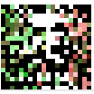
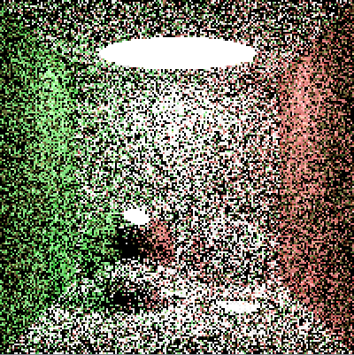
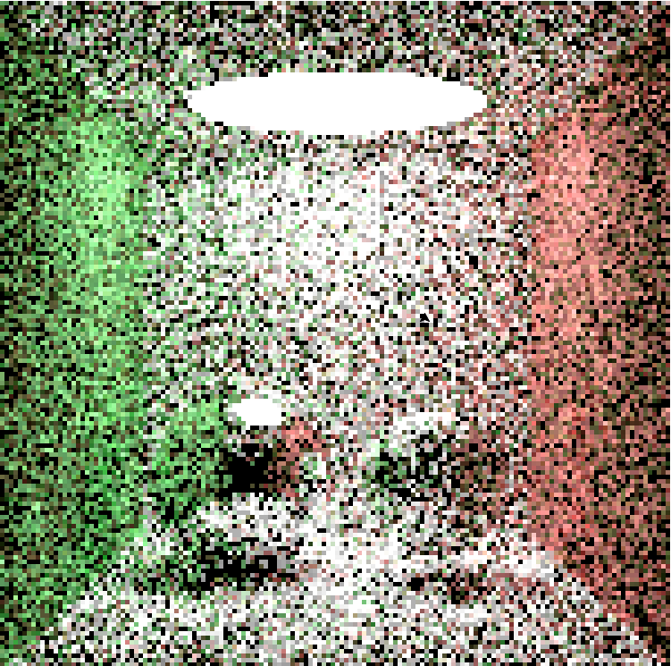
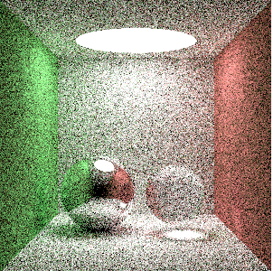
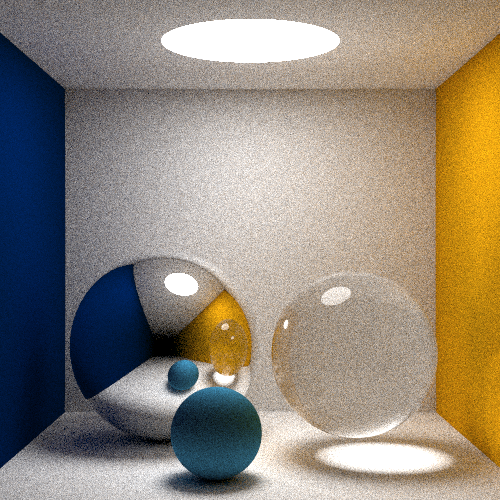

# lux

Lux is a work in progress tail-recursive raytracer written in Scheme. It is able to model diffuse, mirror, and glass spheres. It is partially based off of [smallpt](http://www.kevinbeason.com/smallpt/) and uses techniques from the book *Ray Tracing in One Weekend*.

We started with a naive ray tracing implementation. Running the initial version of the program through a Python3 scheme interpreter, we rendered a 20x20 image of the Cornell box using 4 samples/pixel in around five minutes:

  

This is a 200x200 image of the same scene at 4 samples/pixel, rendered in ~7-8 hours:

  

It became apparent that rendering images at higher resolutions with less noise would take far too long. After exploring a few optimization options, we found that [PyPy](https://pypy.org) could run the Python interpreter at far greater efficiency. Using PyPy3, this 100x100 image of the Cornell box at 10 samples/pixel took around 25 minutes to render:

  

Here is a 300x300 image at 4 samples/pixel:

  

Finally, with adjusted colors, scene arrangement, and an additional diffuse surface, our 500x500 image at 500 samples/pixel:

  

